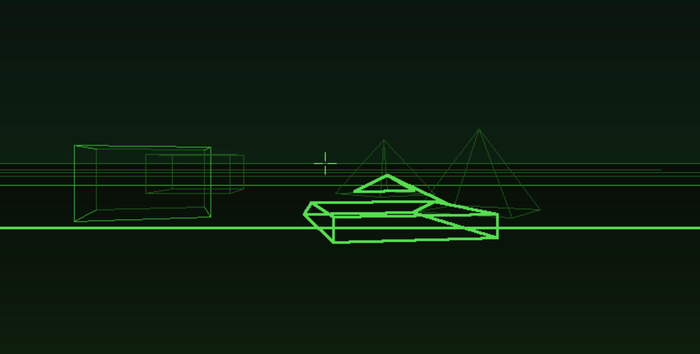

# battlezone

Terminal-first Battlezone prototype in Rust using the Kitty graphics
protocol.

The current implementation uses `crossterm` for input and terminal
control, and transmits each frame as a PNG image using Kitty graphics
escapes. The HUD remains normal terminal text layered over the image.



## Run

```sh
cargo run
```

## Controls

- `W` or `Up`: move forward
- `S` or `Down`: move backward
- `A` or `Left`: turn left
- `D` or `Right`: turn right
- `Space`: fire
- `Q` or `Esc`: quit

## Notes

- This is a terminal reinterpretation, not a pixel-faithful arcade port.
- It currently expects kitty or a terminal that speaks the Kitty
  graphics protocol.
- Ghostty and Warp are treated as known-compatible terminals when
  `TERM_PROGRAM` identifies them.
- If you need to bypass the basic interactive-terminal check, run with
  `BATTLEZONE_FORCE_KITTY=1 cargo run`.
- Key hold behavior depends on terminal key-repeat support.
