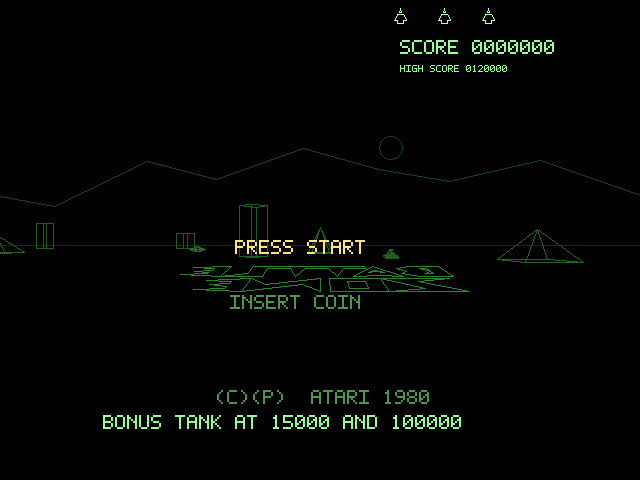

# Battlezone

---

This is a self-contained Rust implementation of Atari's original Battlezone,
rendered through the Kitty graphics protocol.

The current game uses a native Rust state machine for the title screen,
high-score entry, battlefield layout, radar, enemy behaviors, saucer timings,
and scoring/lives flow. During development the obstacle layout and rule tables
were extracted from the original arcade ROM set, but the shipped application no
longer depends on any ROM files at runtime.

<!-- markdownlint-disable MD033 -->

  

<!-- markdownlint-enable MD033 -->

Run targets:

- `cargo run`
- `cargo test`
- `cargo fmt --check`
- `cargo clippy --all-targets -- -D warnings`
- `cargo run --example generate_readme_media`

Run this inside `kitty`, `ghostty`, `warp` or another terminal that supports the
Kitty graphics protocol.

## Install

Install directly from git with Cargo:

- `cargo install --git https://github.com/stephenlclarke/battlezone battlezone`

`cargo install` builds with Cargo's release profile by default. Do not pass
`--debug` unless you explicitly want a slower debug build.

After installation, run the game with:

- `battlezone`

## Controls

- `Enter`: start from the title screen
- `W` or `Up`: drive forward
- `S` or `Down`: reverse
- `A` or `Left`: rotate left
- `D` or `Right`: rotate right
- `Space`: fire
- `Q` or `Esc`: quit

## Notes

- This project is a native implementation, not a 6502 emulator.
- The battlefield obstacle coordinates, bonus-tank defaults, missile threshold,
  and attract-screen strings were extracted from the original arcade data and
  flattened into `assets/arcade/`.
- Audio is synthesized in-process with `rodio`, so no platform-specific helper
  binaries are required.
- If `battlezone` is not found after installation, ensure `~/.cargo/bin` is on
  your `PATH`.

## ROM References

These references were used to extract the battlefield tables and original rule
defaults while keeping the final runtime self-contained:

- [Battlezone disassembly project](https://6502disassembly.com/va-battlezone/):
  annotated ROM listing, obstacle tables, score strings, and gameplay notes.
- [MAME Battlezone driver](https://raw.githubusercontent.com/mamedev/mame/master/src/mame/atari/bzone.cpp):
  machine layout, memory map, and dip-switch defaults.
- [Battlezone revision notes](https://6502disassembly.com/va-battlezone/rev1.html):
  revision history and checksum notes for the program ROMs.

## Platform Support

The game is intended for Unix-like environments with a terminal that speaks the
Kitty graphics protocol.

macOS is the primary target because it has been the main development platform.
Linux should also work, but the audio and terminal stack still need broader
real-world validation.

For automated docs media generation or headless regression work, use the
examples under `examples/` rather than trying to capture an interactive terminal
session directly.
